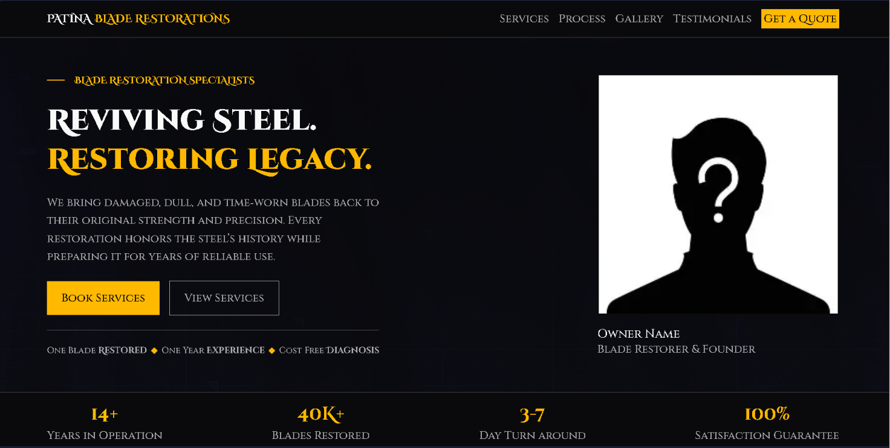

# Patina Blade Restorations

A simple and polished one-page website for a blade restoration business.

## Badges

## Preview

## Live Demo
[Live Link](https://j-co-de.github.io/Blade-Buisness/)

## Features
- Responsive layout for desktop and mobile
- Hero section with clear call-to-action
- Services, gallery, testimonials, process, and contact sections
- Clean styling with modular CSS components
- Lightweight JavaScript interactions

## Project Structure
- index.html — main page structure
- styles.css — shared styles
- script.js — page interactions
- CSS_Components/ — section-specific stylesheet files
- Images/ — image assets

## Usage
1. Clone the repository  
2. Open `index.html` in your browser  
3. Customize content in the HTML and CSS components

## Tech Stack
- HTML5  
- CSS3 (modular components)  
- Vanilla JavaScript  

## About the Creator
Created by **Jackson**, blending digital craftsmanship with real‑world restoration work.  
This project reflects a dedication to clean UI, intentional design, and the heritage of blade restoration.

## License
This project is licensed under the MIT License. See the LICENSE file for details.
